# DM Motor Usage

达妙电机（DM Motor）硬件连接、线材购买与 Python 控制例程说明。

## 目录

- [参考资料](#参考资料)
- [硬件清单](#硬件清单)
- [电机连接](#电机连接)
- [线材购买](#线材购买)
- [电机控制](#电机控制)
- [文件说明](#文件说明)

## 参考资料

| 类型 | 链接 |
| :--- | :--- |
| Summary Document | [飞书文档](https://gl1po2nscb.feishu.cn/wiki/MZ32w0qnnizTpOkNvAZcJ9SlnXb?from=from_copylink) |
| DM 电机上位机使用文档 | [飞书文档](https://gl1po2nscb.feishu.cn/wiki/LjOXwEqNCiqThpk1IIycHoranlb) |
| 使用视频 | [Bilibili](https://www.bilibili.com/video/BV1TDg7zBEci/?spm_id_from=333.1387.upload.video_card.click&vd_source=f65938b935c55207f67b4be1aaaf9b29) |
| Motor Control（Python / ROS） | [Gitee 仓库](https://gitee.com/kit-miao/motor-control-routine) |
| Python 例程 | [DM_Motor_Test.py](https://gitee.com/kit-miao/motor-control-routine/blob/master/Python%E4%BE%8B%E7%A8%8B/u2can/DM_Motor_Test.py) |
| DM-J4310-2EC | [Gitee 仓库](https://gitee.com/kit-miao/DM-J4310-2EC) |

## 硬件清单

<p align="center">
  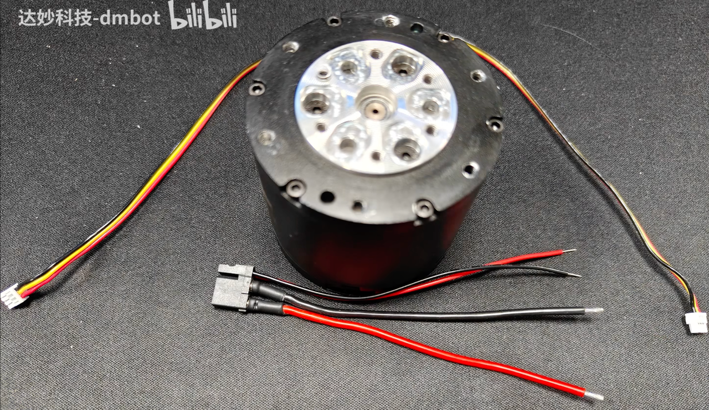
</p>

### 标准套装

| 部件 | 数量 |
| :--- | :---: |
| 电机 | 1 |
| XT30 2+2 单端线 | 1 |
| GH1.25 3pin 线 | 1 |

### 初学者套装

| 套装图片 | 线材细节 |
| :---: | :---: |
| 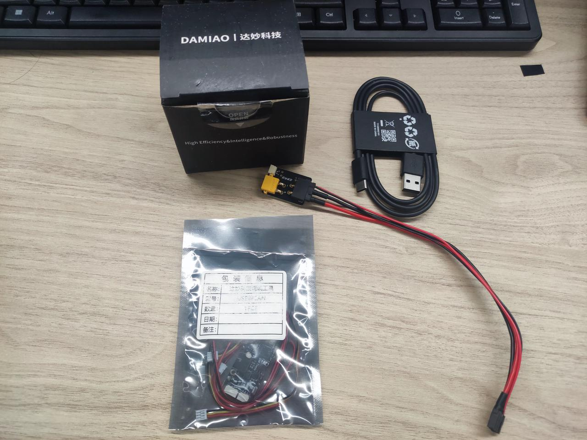 | 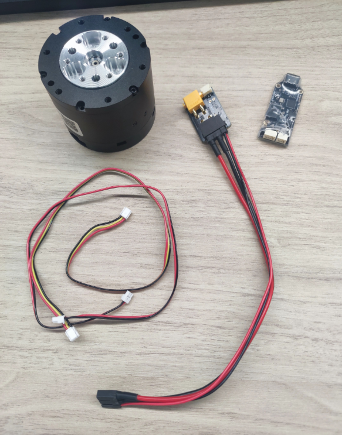 |

| 部件 | 数量 |
| :--- | :---: |
| 电机 | 1 |
| XT30 2+2 单端线 | 1 |
| GH1.25 2pin 同面线 | 1 |
| GH1.25 3pin 异面线 | 1 |
| 电源转接板 | 1 |
| USB2CAN 模块 | 1 |

## 电机连接

### XT30 2+2 单端线

<p align="center">
  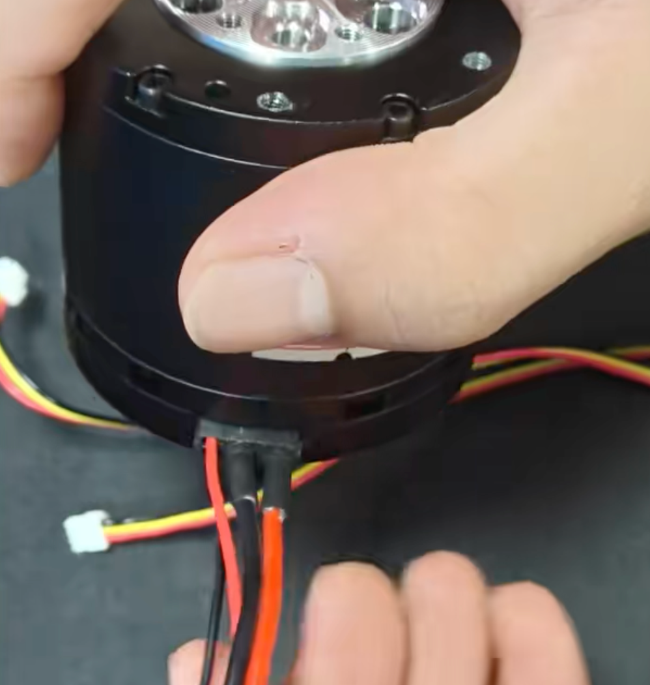
</p>

将 XT30 2+2 单端线插入电机对应接口。43 系列电机有 2 个电机接口，任选其一即可。单端线中的两根细线是 CAN 线。

### GH1.25 3pin 线

GH1.25 3pin 线连接电机 3pin 线接口。

| 接口位置 | 接线细节 |
| :---: | :---: |
| 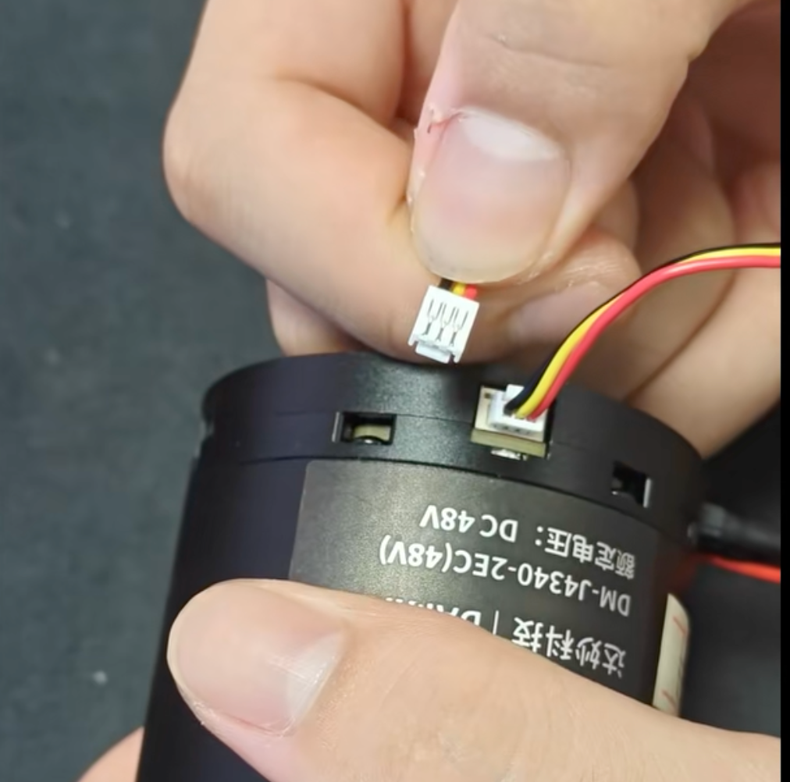 | 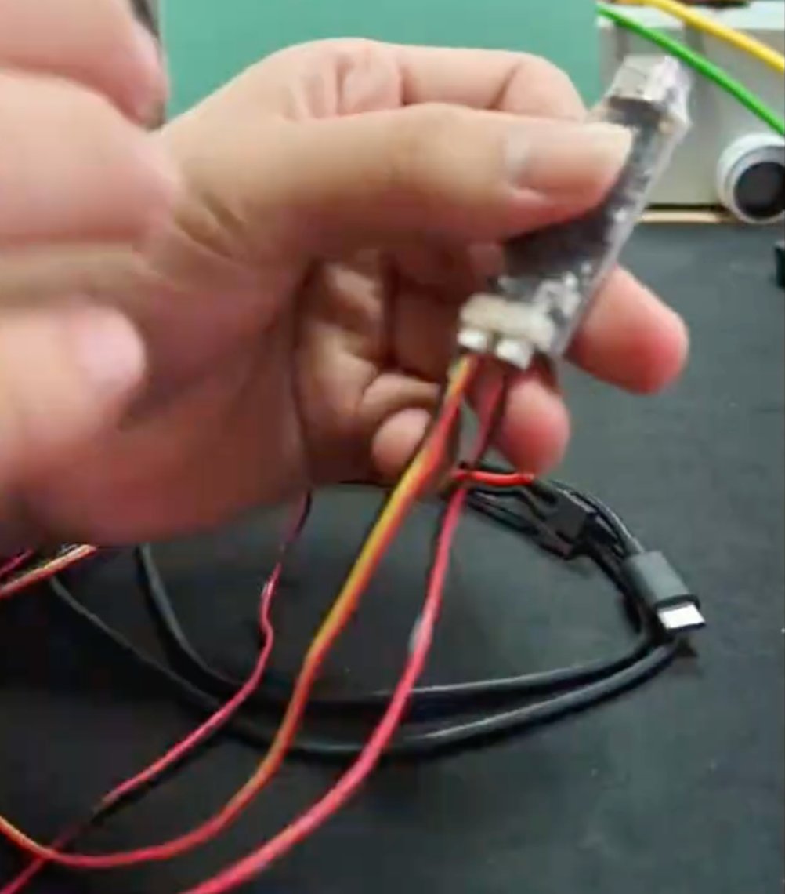 |

### USB2CAN 连接

把 Type-C 线连接到 USB2CAN 模块，另一端连接电脑。

<p align="center">
  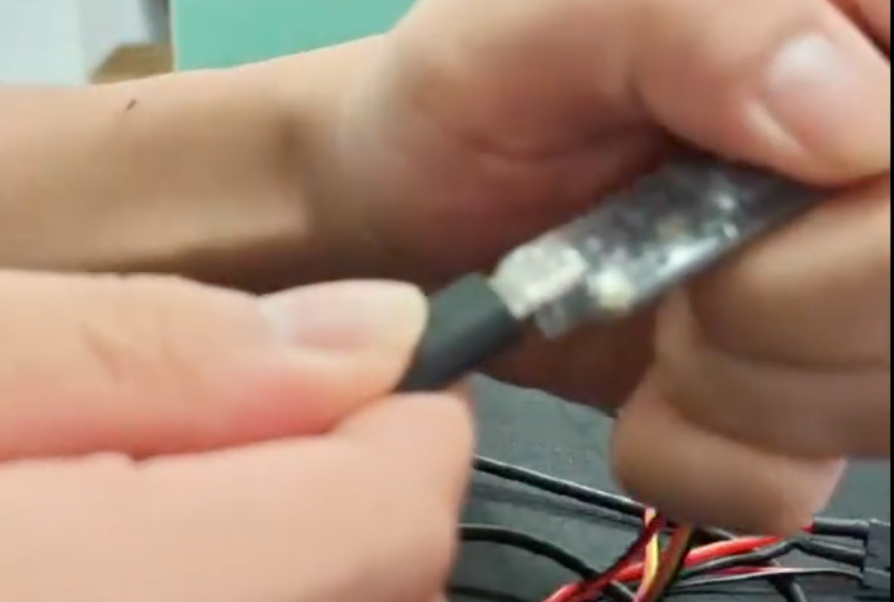
</p>

### 完整连接

<p align="center">
  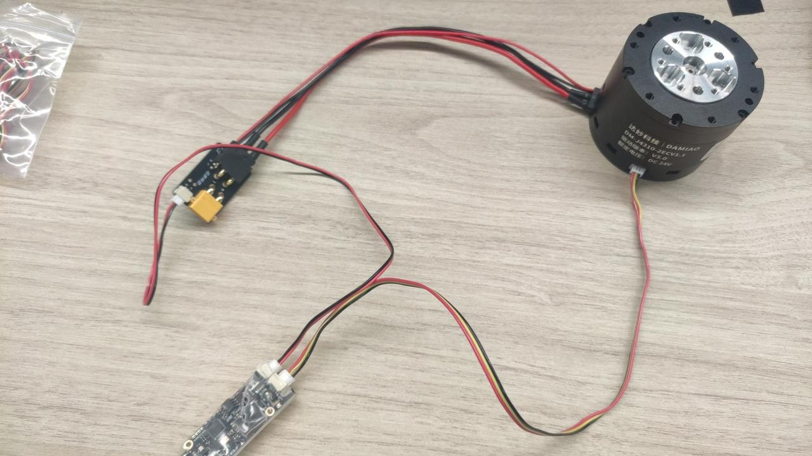
</p>

## 线材购买

| 部件 | 选项 | 数量 | 链接 |
| :---: | :---: | :---: | :--- |
| 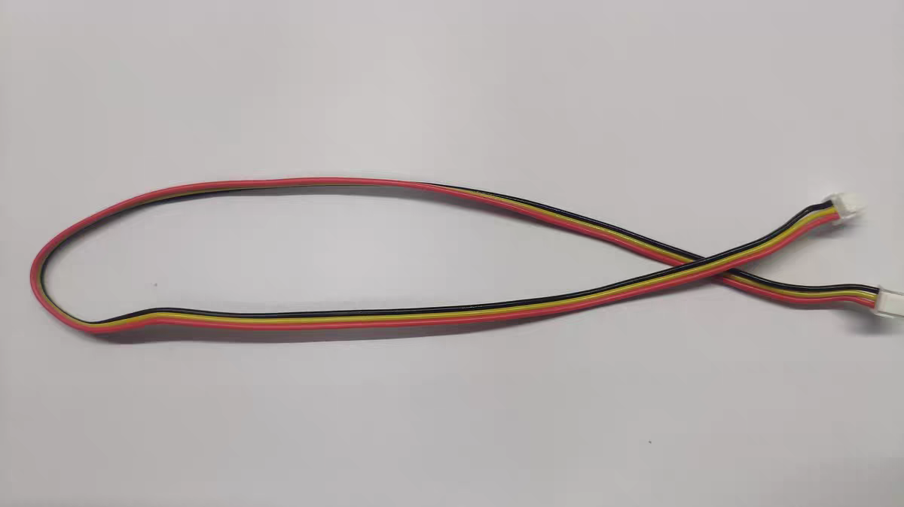 | 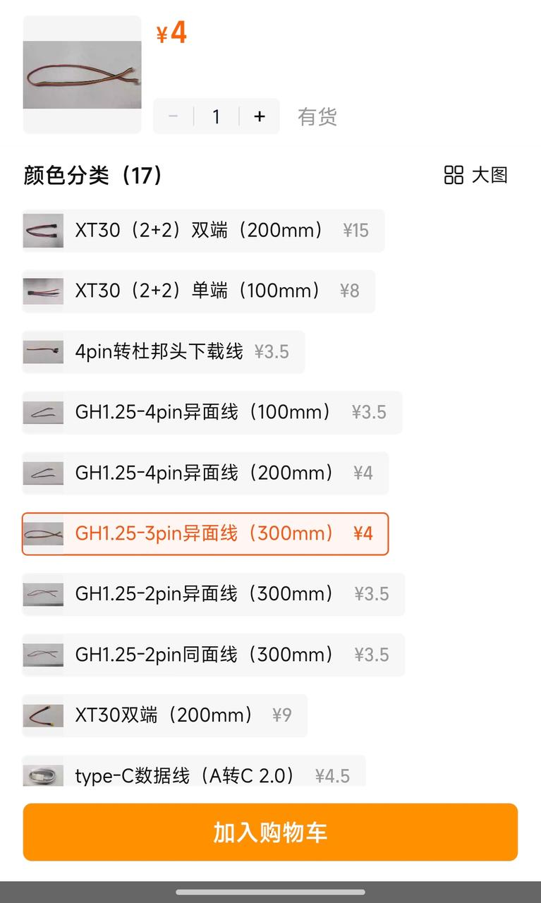 | 1 | [淘宝链接](https://e.tb.cn/h.isDDS27voNSqT3r?tk=Oxp05j3TRQr) |
| 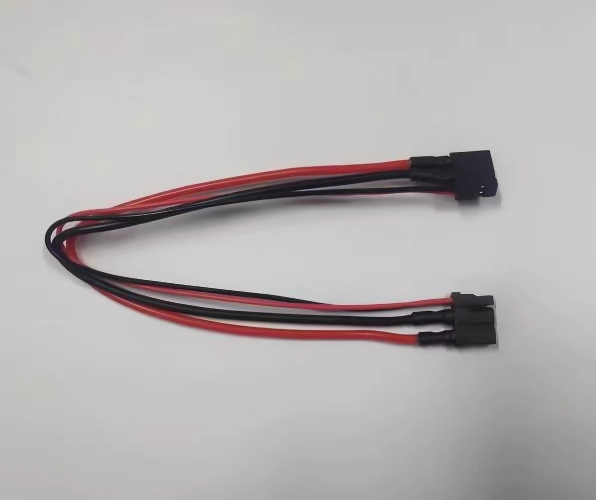 | 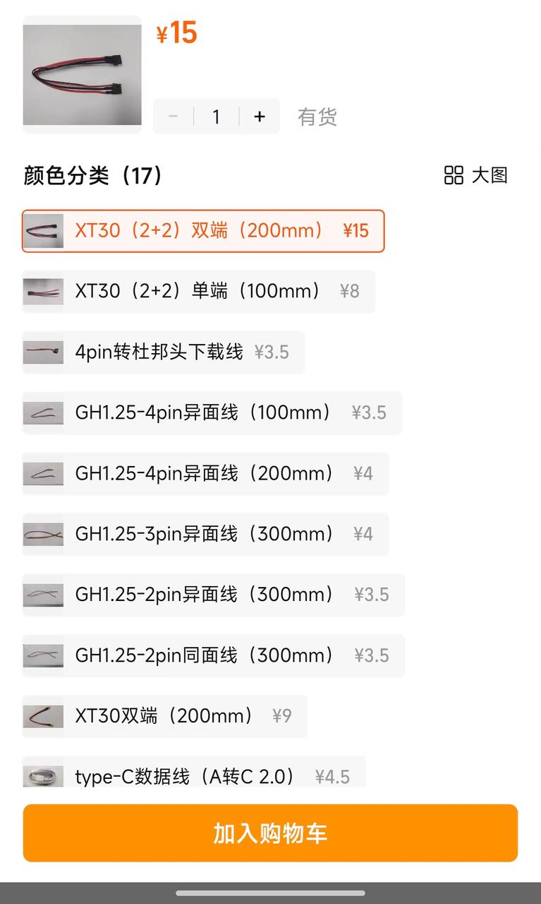 | 1 | [淘宝链接](https://e.tb.cn/h.itfJjhEv3Wh21cZ?tk=Mp7c5j3i32r) |
| 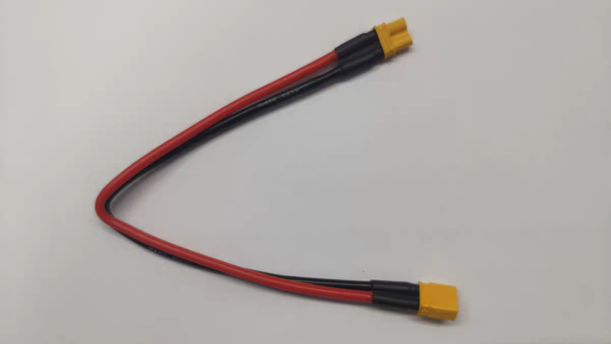 | 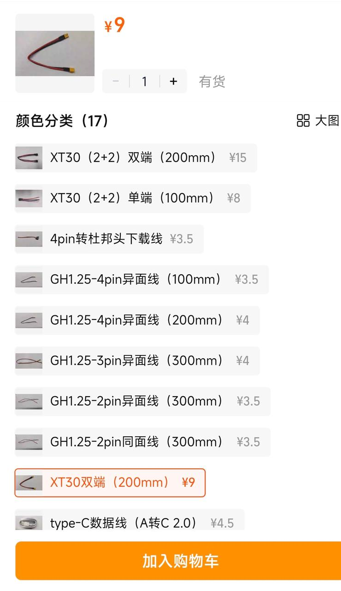 | 1 | [淘宝链接](https://e.tb.cn/h.isxcw5zOA6DnWG0?tk=8ZrZ5j3lKcg) |
| - | 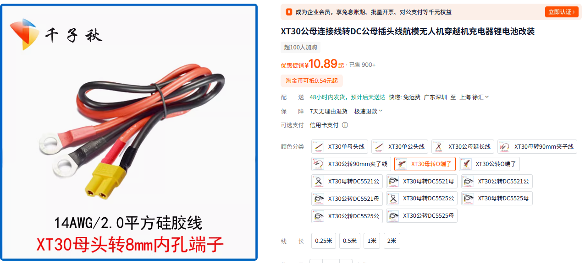 | 1 | [淘宝链接](https://item.taobao.com/item.htm?id=708938197611) |

## 电机控制
### 端口授权
```
cd DM_Motor
sudo chmod 777 setup_tty_acm.sh
./setup_tty_acm.sh
```
output
```
❯ ./setup_tty_acm.sh 
Found serial port(s):
crwxrwxrwx 1 root dialout 166, 0 May 28 00:44 /dev/ttyACM0

Setting permission: sudo chmod 777 /dev/ttyACM0
[sudo] password for ubuntu2204: 
Done:
crwxrwxrwx 1 root dialout 166, 0 May 28 00:44 /dev/ttyACM0
```

### 示教模式

```bash
cd DM_Motor
python motor_teach.py
```

### 电机控制模式

```bash
cd DM_Motor
python motor_control.py
```

## 文件说明

| 文件 | 说明 |
| :--- | :--- |
| `DM_CAN.py` | DM Motor 官方控制库 |
| `DM_motor_example.py` | DM Motor 官方控制示例 |
| `DM_motor_class.py` | DM Motor class 封装库 |
| `motor_control.py` | 电机控制入口 |
| `motor_teach.py` | 示教模式入口 |
